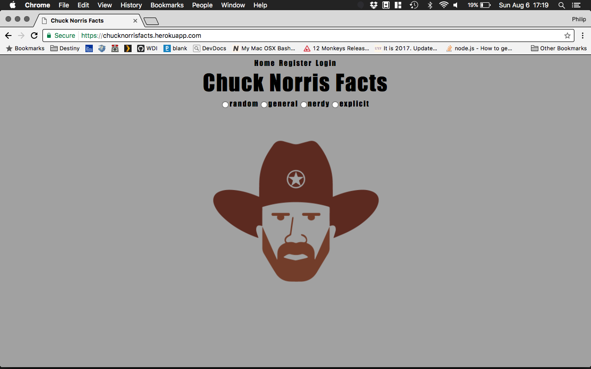
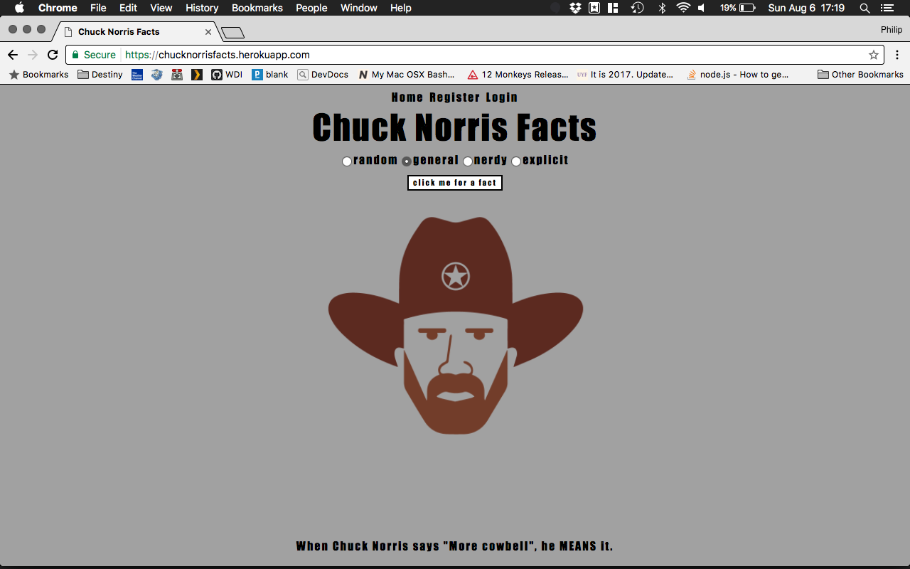
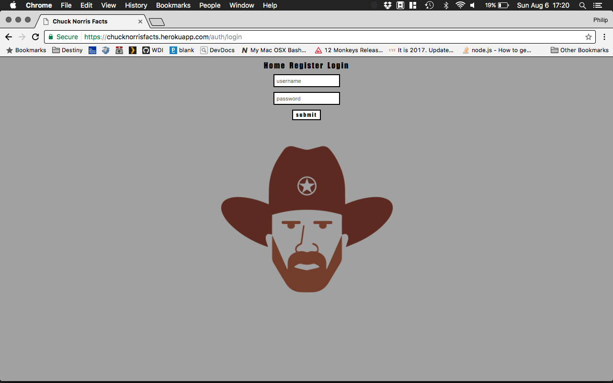
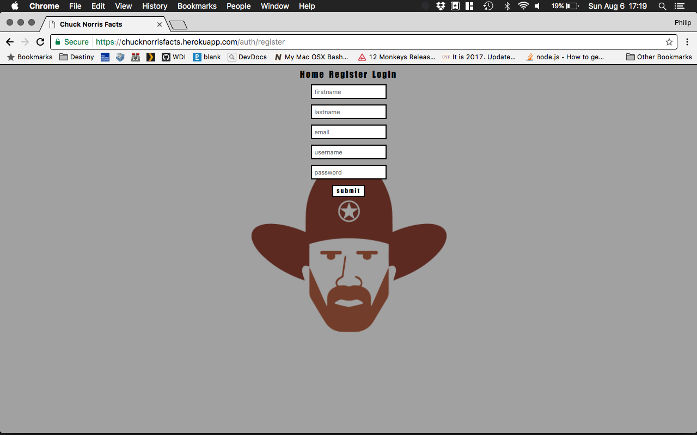
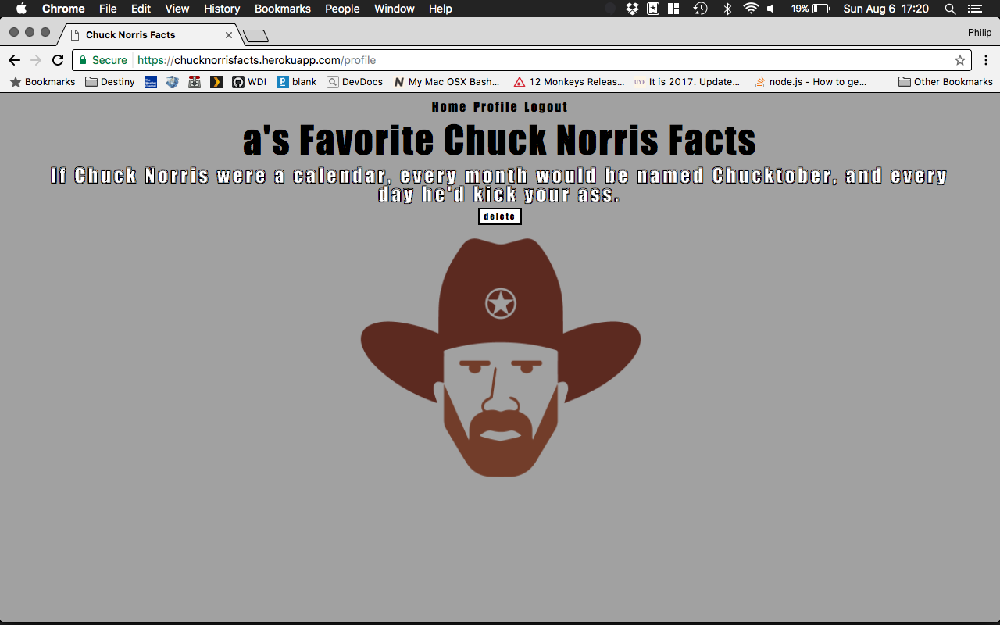

# Chuck Norris Facts








## What is Chuck Norris Facts?

Chuck Norris Facts is a simple app that will generate a random fact about Chuck Norris.

## Technical Discussion

* HTML
* CSS
* JavaScript/jQuery
* Node.js
* Express
* EJS

### Notes on App Structure

#### Code Samples

using the api to get data based on the category the user picked

```
let fact_type = $('input[name=fact_type]:checked').val()

let url = ''

switch(fact_type){
  case 'random':
    url = 'https://api.icndb.com/jokes/random/?escape=javascript'
    break
  case 'general':
    url = 'https://api.icndb.com/jokes/random/?escape=javascript&exclude=[nerdy, explicit]'
    break
  case 'nerdy':
    url = 'https://api.icndb.com/jokes/random/?escape=javascript&limitTo=[nerdy]'
    break
  case 'explicit':
    url = 'https://api.icndb.com/jokes/random/?escape=javascript&limitTo=[explicit]'
    break
}

fetch(url)
  .then(fetchRes => fetchRes.json())
  .then((data) => {
    fact.fact = data.value.joke
    $('#fact p').text(fact.fact)
    if($('#fact p').text() !== ''){
      $('#fact span').html('<button>')
      let $save_fact_btn = $('#fact span button')
      $save_fact_btn.attr('id', 'save_fact')
      $save_fact_btn.text('save fact')
    }
    $('#save_fact').attr('disabled', false)
  })
```
#### Challeneges
CSS and thinking of how to design the app

## The Making of Higher or Lower
[chuck norris api](http://www.icndb.com/api/)

## Opportunities for Future Growth

I am satisfied with what I built. One future feature I'd like to add is the ability for users to share their favorite fact.