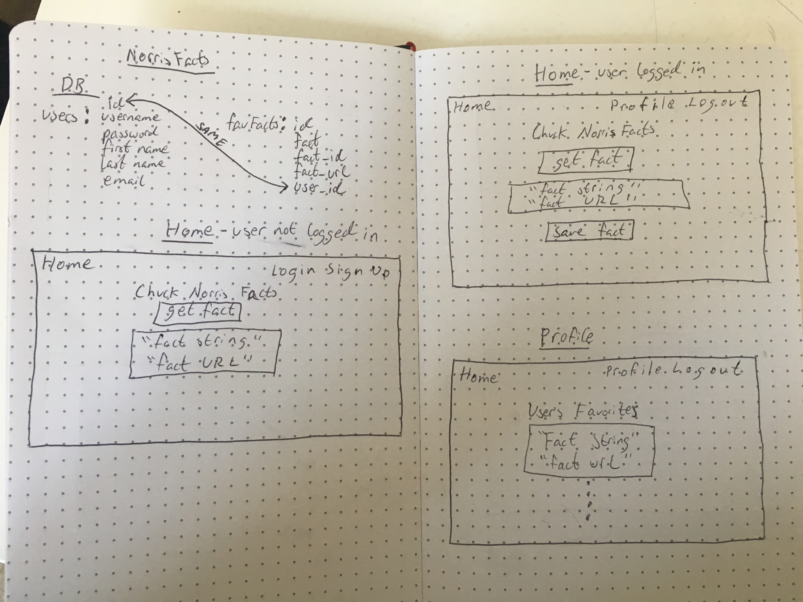
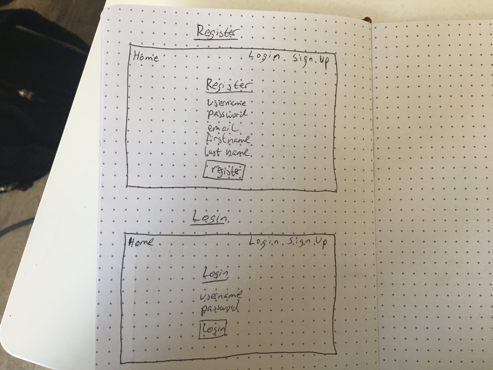

*** Philip Zak / 7.31.17 ***

# Chuck Norris Facts Proposal

## What is Norris Facts?

Chuck Norris Facts is a simple app that will generate a random fact about Chuck Norris.

## Wireframe

## Initial thoughts on app structure

The app is pretty basic. User will be presented with a button that will generate a random fact when clicked. Under the fact, there will be a link so the user can share the fact with their friends. If the user is a registered user and logged in, they will see a button under the fact link that will let them save the fact. The user can go to their profile page and see all their saved facts.

## User Stories
When on the home screen, a user can click on a button to generate a random Chuck Norris fact. The user can share the fact with their friends. The user can create an account if they want to save the facts. The user can also unsave facts they no longer want to keep.

## Phases of Completion

### Phase 0
* set up file structure 
* create all the necessary files

### Phase 1
* get a random fact from the api
* display the random fact

### Phase 2
* user can sign up for an account
* user can login and logout

### Phase 3 - MVP
* user can save favorite facts
* user can go to their profile page and see their favorite facts

### Phase 4
* user can select a fact category

## Links and Resources
[chuck norris api](http://www.icndb.com/api/)

## Notes
ignore the fact_url column in the favFacts table. there's no need for me to save the fact's url.
